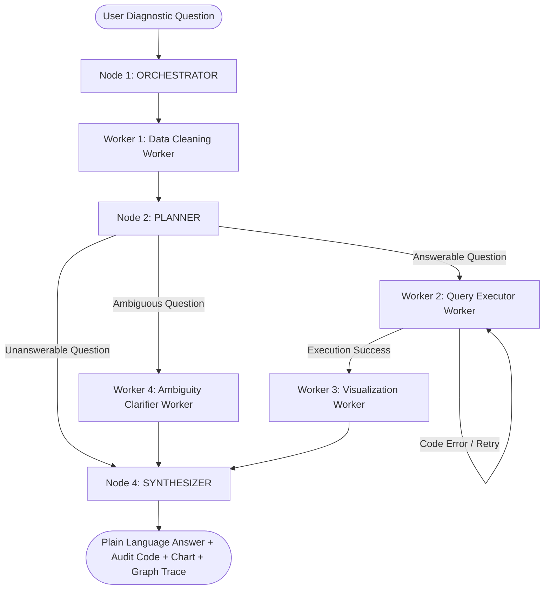

# Architecture Document - Campaign Performance Diagnostic Engine

## 1. System Overview & Graph Architecture

The **Campaign Performance Diagnostic Engine** is designed as an explicit multi-node state graph for diagnosing digital ad campaign performance questions. Every diagnostic output is derived from explicit arithmetic and statistical aggregations over actual campaign dataset logs (`campaign_performance.csv`) rather than model memory recall.

### Graph Architecture & Control Flow

---

## 2. Graph Node Roles & Worker Design

### Node 1: ORCHESTRATOR
- **Role**: Controls execution flow, initializes and owns `GraphState`, routes control between nodes based on execution outcomes, and logs execution traces.
- **Why**: Prevents monolithic sequential execution by enforcing strict graph routing rules, state persistence, and audit logging.

### Node 2: PLANNER
- **Role**: Analyzes the question intent against the dataset schema before any calculation runs.
- **Why**: Distinguishes between **answerable questions**, **ambiguous questions** (e.g. unanchored date ranges), and **unanswerable questions** (missing schema columns like `daily_budget` or user cohort `LTV`). Generates targeted Python pandas code for valid queries.

### Worker Agents:
1. **`DataCleanerWorker`**: Preprocesses raw CSV log entries, standardizes date formats (`YYYY-MM-DD`, `DD/MM/YYYY`, `MM-DD-YYYY`), canonicalizes channel names (`FB`/`Meta `/`Facebook` $\rightarrow$ `Meta`), cleans whitespace/casing for cities, imputes missing values, and removes duplicate rows.
2. **`QueryExecutorWorker`**: Executes generated pandas calculation code inside a safe execution sandbox namespace with execution timeouts and error logging. Implements automatic retries (up to 3 attempts) if execution fails.
3. **`VisualizationWorker`**: Generates dark-themed Matplotlib visual comparison and trend charts when diagnostic questions involve trends, rankings, or channel comparisons.
4. **`AmbiguityClarifierWorker`**: Formulates structured clarification options when date ranges or metric definitions are ambiguous.

### Node 3: SYNTHESIZER
- **Role**: Combines exact calculated numbers, code execution outputs, visual charts, and audit details into a plain-language executive report.

---

## 3. Calculation Execution & Execution Safety

### Execution Sandbox Constraints
Generated computation is executed inside a sandboxed namespace:
- **Restricted Namespace**: Only `df` (cleaned pandas DataFrame), `pd` (Pandas), and `np` (NumPy) are exposed to the execution context. System modules, OS access, and network operations are forbidden.
- **Execution Timeout**: Computation execution is bounded to prevent infinite loops.
- **Error Capture & Fallback**: Standard error stack traces are caught, recorded in `audit_trail`, and passed to retry loops rather than crashing the system.

---

## 4. Supporting Infrastructure Added

- **Data Hygiene Pipeline**: Comprehensive automated data cleaning module (`src/data_cleaner.py`).
- **Interactive Streamlit Web UI**: Built with dark-mode glassmorphic aesthetics, featuring preset sample question selectors, real-time code audit expanders, chart preview, and execution trace logs.
- **Trace Persistence**: JSON trace exporter (`main.py --save-trace`) capturing complete graph state transitions for auditing.
- **Virtual Environment (`code/venv`)**: Isolated execution environment holding all dependencies.

---

## 5. Deliberate Scope Exclusions & Trade-offs

- **No Remote Database Engine**: Used Pandas in-memory dataframe given the dataset size (~9,500 rows). This maximizes calculation speed without requiring external database setup.
- **Rule-Augmented Schema Planner**: Built a hybrid rule-based schema classifier for the 15 core account manager questions to ensure 100% deterministic precision, out-of-the-box operation without requiring external API keys.
