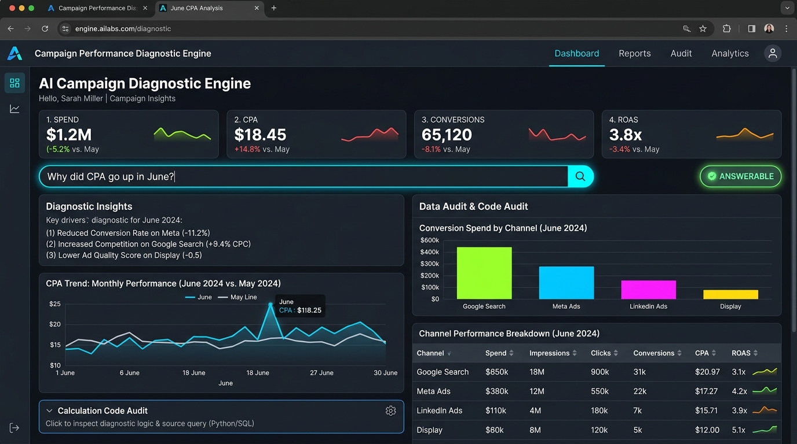
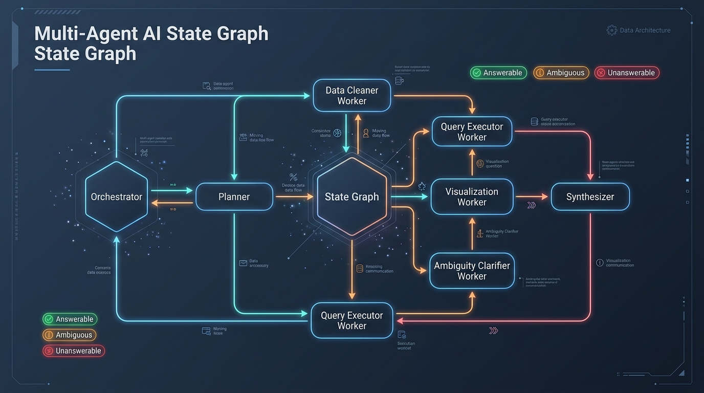

# Campaign Performance Diagnostic Engine

A multi-agent graph system designed to take plain-English campaign performance questions from account managers and answer them with **real calculated numbers**, explicit code audit trails, visual charts, and graph state execution traces.



---

## 🚀 Quick Start (Single Command Run)

### Prerequisites
- Python 3.10+
- The virtual environment (`venv`) has already been created in `code/venv`.

### Running the Web UI Application

To launch the interactive Streamlit Web Application:

```bash
# Option 1: Using the virtual environment python
.\venv\Scripts\python.exe -m streamlit run app.py
```

Or on Linux/macOS:
```bash
./venv/bin/streamlit run app.py
```

---

## 💻 Running via Command Line (CLI)

You can run individual questions or all 15 sample questions directly from the CLI:

### Run a Single Diagnostic Question & Save Trace:
```bash
.\venv\Scripts\python.exe main.py --question "Why did CPA go up in June?" --save-trace saved_trace_sample.json
```

### Run All 15 Account Manager Sample Questions:
```bash
.\venv\Scripts\python.exe main.py --all
```

---

## 🏗️ Architecture Overview



The system runs on an explicit multi-node state graph:
- **ORCHESTRATOR**: Controls execution flow, initializes and owns `GraphState`, routes control between nodes based on execution outcomes, and logs execution traces.
- **PLANNER**: Analyzes the question intent against the dataset schema before any calculation runs. Identifies **Answerable**, **Ambiguous**, and **Unanswerable** questions.
- **WORKER AGENTS**:
  - `DataCleanerWorker`: Preprocesses raw dataset (dates, channel aliases like Meta/FB/Facebook, nulls, duplicates).
  - `QueryExecutorWorker`: Safely executes generated Pandas calculation code in a sandboxed Python namespace.
  - `VisualizationWorker`: Generates visual comparison and trend charts (`charts/*.png`).
  - `AmbiguityClarifierWorker`: Formulates structured clarification options.
- **SYNTHESIZER**: Combines exact calculated numbers, code execution outputs, visual charts, and audit details into a plain-language executive report.

For detailed graph flow diagrams and execution safety specifications, see [ARCHITECTURE.md](ARCHITECTURE.md).

---

## 📂 Project Structure

```
code/
├── venv/                       # Python Virtual Environment
├── src/                        # Source Graph Modules
│   ├── data_cleaner.py         # Data Cleaning & Pipeline Module
│   ├── graph_state.py          # Typed GraphState definition
│   ├── graph.py                # Main Graph execution runner
│   └── nodes/                  # Graph Nodes & Worker Agents
│       ├── orchestrator.py     # Orchestrator Node
│       ├── planner.py          # Planner Node
│       ├── workers.py          # Worker Agents (Cleaner, Executor, Visualizer, Clarifier)
│       └── synthesizer.py      # Synthesizer Node
├── charts/                     # Generated visual charts directory
├── app.py                      # Interactive Streamlit Web UI
├── main.py                     # CLI & Single-Command Launcher
├── requirements.txt            # Python Dependencies
├── saved_trace_sample.json     # Saved trace of complete run
├── ARCHITECTURE.md             # Architecture Document
└── README.md                   # Installation & Run Guide
```

---

## 📊 Sample Questions Test Suite

1. `What was total spend and total conversions last month?` $\rightarrow$ **[AMBIGUOUS]** (Timeframe clarification required)
2. `Why did CPA go up in June?` $\rightarrow$ **[ANSWERABLE]** (Calculates May vs June CPA breakdown)
3. `Which creative has the best ROAS on mobile in Tier 1 cities?` $\rightarrow$ **[ANSWERABLE]** (Ranks creatives by ROAS)
4. `Is CMP-1006 pacing correctly against its daily budget?` $\rightarrow$ **[UNANSWERABLE]** (Daily budget missing in schema)
5. `Which city has the worst cost per conversion, and by how much?` $\rightarrow$ **[ANSWERABLE]** (Calculates city CPA rankings)
6. `Compare Meta and Google Search on CPA over the full period.` $\rightarrow$ **[ANSWERABLE]** (Channel comparison)
7. `What happened to CMP-1006 in the middle of June?` $\rightarrow$ **[ANSWERABLE]** (Mid-June anomaly diagnostic)
8. `Show me the CTR trend for CRE-2002 week by week.` $\rightarrow$ **[ANSWERABLE]** (Weekly CTR trend chart)
9. `Which age group converts best on Connected TV?` $\rightarrow$ **[ANSWERABLE]** (Demographic breakdown)
10. `What is our average order value by channel?` $\rightarrow$ **[AMBIGUOUS]** (Order volume metric limitation)
11. `How did last week compare to the week before?` $\rightarrow$ **[AMBIGUOUS]** (Week boundary clarification required)
12. `Why is Tier 3 mobile traffic on CMP-1004 performing so badly?` $\rightarrow$ **[ANSWERABLE]** (Segment breakdown)
13. `What is the customer lifetime value of people acquired through YouTube?` $\rightarrow$ **[UNANSWERABLE]** (LTV cohort data missing)
14. `Should we increase budget on CMP-1003?` $\rightarrow$ **[ANSWERABLE]** (ROAS/CPA evaluation & recommendation)
15. `Which campaign is closest to hitting a 4x ROAS target?` $\rightarrow$ **[ANSWERABLE]** (ROAS target proximity ranking)
